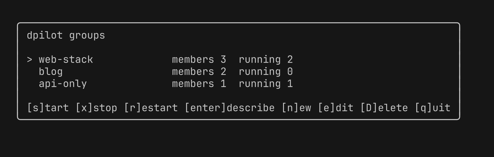
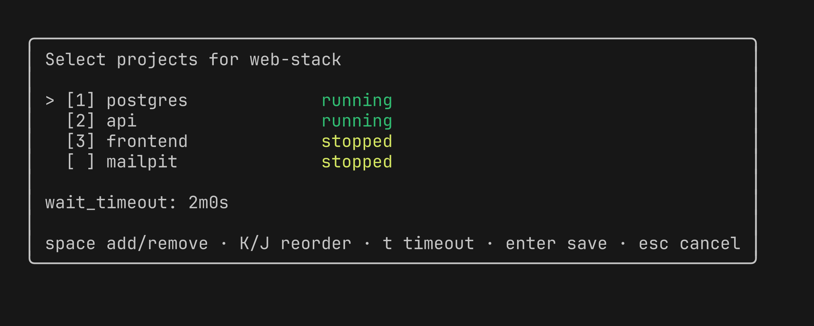

# dpilot

dpilot orchestrates ordered groups of [ddev](https://github.com/ddev/ddev) projects.
A dpilot group is a named, ordered set of ddev projects defined at
`~/.dpilot/groups/<name>.yaml`. dpilot starts members in order (waiting for each
to be ready before the next) and stops them in reverse, driving ddev through its
CLI. It mirrors ddev's commands, aliases, flags, and output for familiarity.

```bash
dpilot create mystack
dpilot add mystack db-services
dpilot add mystack api
dpilot start mystack      # start each member in order, readiness-gated
dpilot describe mystack   # show members and live ddev state (alias: status)
dpilot stop mystack       # stop in reverse order
```

## Screenshots

The dashboard (run `dpilot` with no arguments) and the interactive group editor (`dpilot create <group>`):





## Install

**Homebrew** (macOS and Linux):

```bash
brew install haraldpdl/tap/dpilot
```

**Go** (requires Go 1.25+):

```bash
go install github.com/haraldpdl/dpilot/cmd/dpilot@latest
```

**Download a release binary** from the [releases page](https://github.com/haraldpdl/dpilot/releases),
extract the archive for your OS and architecture, and place `dpilot` on your `PATH`.
On macOS a downloaded binary is quarantined by Gatekeeper; clear it with
`xattr -c dpilot`, or install via Homebrew.

**Build from source** (requires Go 1.25+):

```bash
git clone https://github.com/haraldpdl/dpilot.git
cd dpilot
go build -o dpilot ./cmd/dpilot
```

## Commands

dpilot's command vocabulary mirrors ddev so the two feel like one toolset.

| Command | Alias | Description |
|---|---|---|
| `dpilot start <group>` | | Start members in order, readiness-gated. Fail-fast: if a member errors or times out, remaining members are not started; already-started members are left running. |
| `dpilot stop <group>` | | Stop members in reverse order, best-effort (all members attempted; failures reported at the end). |
| `dpilot restart <group>` | | Stop (best-effort) then start (fail-fast). |
| `dpilot list` | `l` | List all groups with aggregate state in a ddev-style table. |
| `dpilot describe <group>` | `status` | Show a group's members in order with their live ddev state. |
| `dpilot create <group>` | | Scaffold an empty group file. Errors if the group already exists. |
| `dpilot add <group> <project> [--after <member>]` | | Append a member, or insert it after a named member. Validates the project exists via `ddev list -j`. |
| `dpilot remove <group> <project>` | | Drop a member from the group. |
| `dpilot delete <group>` | | Delete the group file. Requires `-y` to confirm. |
| `dpilot version` | | Print the dpilot version. |

### Flags

| Flag | Commands | Description |
|---|---|---|
| `-j, --json-output` | `list`, `describe` | Machine-readable JSON output, matching ddev's `-j` behavior. |
| `-y, --yes` | `delete` | Skip the confirmation prompt. |
| `--after <member>` | `add` | Insert the new member after `<member>` instead of appending. |

### Ordering and readiness

`dpilot start` waits for each member to reach `running` state (via `ddev describe -j`)
before starting the next. The per-member timeout defaults to 120 seconds and can be
overridden per group with `wait_timeout` in the group YAML.

Member order is the list order in the YAML. To reorder an existing member, use
`dpilot remove` followed by `dpilot add --after`.

## Releases

Releases are published to GitHub when a `v*` tag is pushed:

```bash
git tag v0.1.0
git push origin v0.1.0
```

The release workflow (`.github/workflows/release.yml`) uses goreleaser to
cross-compile binaries for Linux and macOS (amd64 and arm64), attach them to the
GitHub release, and update the Homebrew formula in `haraldpdl/homebrew-tap`. The
release itself uses the automatic `GITHUB_TOKEN`; updating the tap needs a
`HOMEBREW_TAP_TOKEN` secret with write access to the tap repo.

## Integration tests

The `integration/` package contains end-to-end tests that drive a real ddev
binary. They are excluded from normal CI (`go test ./...`) and only run when the
`integration` build tag is set.

Requirements: ddev installed and a project named `dpilot-fixture` registered.

```bash
go test -tags integration ./integration/...
```

## Interactive TUI

Run `dpilot` with no arguments in a terminal to open the dashboard, a full-screen
view of your groups:

- Move with the arrow keys (or `j`/`k`).
- `s` start, `x` stop, `r` restart the selected group. ddev's output streams,
  then the dashboard returns and refreshes the running counts.
- `enter` describe the selected group (members and live state).
- `n` create a new group, `e` edit the selected group, `D` delete it.
- `q` quit.

Run `dpilot create <group>` in a terminal to open the group editor (the same
picker reached from the dashboard's `n` and `e`):

- Move with the arrow keys; `space` adds or removes the highlighted ddev project.
  Selected projects show their start-order number.
- `K`/`J` move the highlighted selected project earlier or later in the order.
- `t` edits the readiness wait_timeout.
- `enter` saves, `esc` cancels.

When stdin or stdout is not a terminal (scripts, CI, pipes), dpilot stays
non-interactive: bare `dpilot` prints help, and `dpilot create <group>` makes an
empty group you populate with `dpilot add`.

## License

dpilot is released under the MIT License. See [LICENSE](LICENSE).
