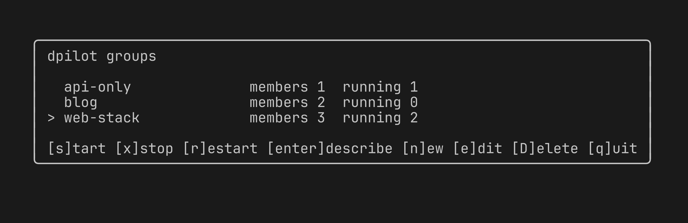
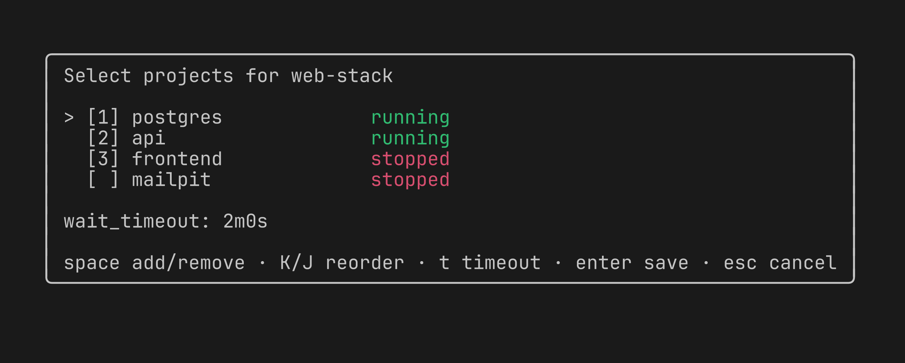

# dpilot

[](https://github.com/haraldpdl/dpilot/actions/workflows/ci.yml)
[](https://github.com/haraldpdl/dpilot/releases)
[](LICENSE)

dpilot orchestrates ordered groups of [ddev](https://github.com/ddev/ddev) projects.
A dpilot group is a named, ordered set of ddev projects defined at
`~/.dpilot/groups/<name>.yaml`. dpilot starts members in order (waiting for each
to be ready before the next) and stops them in reverse, driving ddev through its
CLI. Its verbs, aliases, flags and output follow ddev's so the two feel like one
toolset.

```bash
dpilot create mystack
dpilot add mystack db-services
dpilot add mystack api
dpilot start mystack      # start each member in order, readiness-gated
dpilot describe mystack   # show members and live ddev state (alias: status)
dpilot stop mystack       # stop in reverse order
```

## Screenshots

The dashboard (run `dpilot` with no arguments) and the interactive group editor (`dpilot create <group>`):





## Install

**Homebrew** (macOS):

```bash
brew install haraldpdl/tap/dpilot
```

**Go** (requires Go 1.25+):

```bash
go install github.com/haraldpdl/dpilot/cmd/dpilot@latest
```

**Download a release binary** from the [releases page](https://github.com/haraldpdl/dpilot/releases),
extract the archive for your OS and architecture, and place `dpilot` on your `PATH`.
On macOS a downloaded binary is quarantined by Gatekeeper; clear it with
`xattr -c dpilot`, or install via Homebrew.

**Build from source** (requires Go 1.25+):

```bash
git clone https://github.com/haraldpdl/dpilot.git
cd dpilot
go build -o dpilot ./cmd/dpilot
```

## Commands

dpilot's command vocabulary follows ddev's. One deliberate difference: here
`add` and `remove` edit a group's membership, whereas ddev uses them as legacy
aliases of `start` and `stop`.

| Command | Alias | Description |
|---|---|---|
| `dpilot start <group ...>` | | Start members in order, readiness-gated. Fail-fast: if a member errors, times out, or Ctrl-C is pressed, remaining members are not started; already-started members are left running. Several groups run one after another; `--all`/`-a` starts every group in name order. |
| `dpilot stop <group ...>` | | Stop members in reverse order, best-effort (all members attempted; failures reported at the end). Ctrl-C stops driving ddev and names the members whose state is now unknown. `--all`/`-a` stops every group in reverse name order. |
| `dpilot restart <group ...>` | | Stop (best-effort) then start (fail-fast). With `--all`/`-a`: stop every group in reverse name order, then start every group in name order. |
| `dpilot list` | `l`, `ls` | List all groups with aggregate state in a ddev-style table. A group whose file cannot be loaded is listed as `invalid` with its error; the others are unaffected and the command still exits 0 (`-j` carries an `error` field on that row). |
| `dpilot describe <group>` | `status`, `st`, `desc` | Show a group's members in order with their live ddev state. |
| `dpilot create <group>` | | Scaffold an empty group file. Errors if the group already exists. |
| `dpilot add <group> <project> [--after <member>]` | | Append a member, or insert it after a named member. Validates the project exists via `ddev list -j`. |
| `dpilot remove <group> <project>` | | Drop a member from the group. |
| `dpilot delete <group>` | | Delete the group file. Asks `OK to delete group "<name>"? [Y/n]` on a terminal (blank answer means yes, as in ddev); when not interactive it refuses without `-y`, where ddev would take the default. |
| `dpilot version` | `--version`, `-v` | Print `dpilot version <x.y.z>`. |

### Flags

| Flag | Commands | Description |
|---|---|---|
| `-j, --json-output` | `list`, `describe`, `version` (accepted anywhere: `dpilot -j list` or `dpilot list -j`) | Machine-readable output in ddev's `-j` envelope: `{"level","msg","raw","time"}` with the data under `raw` and the rendered text under `msg`; any error becomes a `fatal` JSON line on stderr. Lifecycle and authoring commands keep their plain progress text, and ddev's own output streams through unchanged. |
| `-y, --yes` | `delete` | Skip the confirmation prompt. |
| `-a, --all` | `start`, `stop`, `restart` | Act on every group instead of naming them. Like ddev, it refuses to run if any group file fails to load, and naming groups together with `--all` is an error. |
| `--after <member>` | `add` | Insert the new member after `<member>` instead of appending. |

### Group names and members

New group names may use letters, digits, `.`, `_` and `-`, and must start with
a letter or digit; group files created by earlier releases with looser names
keep working. Members must be valid ddev project names; dpilot rejects any
other value in a group file and always passes names to ddev after `--`, so a
member can never be read as a ddev flag. The filename is the group's identity:
the `name:` field inside the YAML is informational.

### Ordering and readiness

`dpilot start` waits for each member to reach `running` state (via `ddev describe -j`)
before starting the next. The per-member timeout defaults to 120 seconds and can be
overridden per group with `wait_timeout` in the group YAML (must be positive).

Member order is the list order in the YAML. To reorder an existing member, use
`dpilot remove` followed by `dpilot add --after`.

## Development

`make ci` runs the same gates as GitHub Actions: gofmt, go vet, staticcheck,
`go mod tidy` drift, tests, build, a cross-compile of every release target and
govulncheck (CI additionally runs the tests with `-race`; `make ci
TESTFLAGS=-race` reproduces that). CI builds with the Go major in
`.go-version`; go.mod sets the language floor. `make hooks` points this clone's
`core.hooksPath` at `.githooks`, so the fast subset runs before each commit and
the full set before each push. The hooks check the working tree, not only the
staged changes, and any branch you check out afterwards supplies its own
`.githooks` scripts. `make integration` runs the ddev-backed tests below.

## Integration tests

The `integration/` package contains end-to-end tests that drive a real ddev
binary. They are excluded from normal CI (`go test ./...`) and only run when the
`integration` build tag is set.

Requirements: ddev installed and a project named `dpilot-fixture` registered.

```bash
go test -tags integration ./integration/...
```

## Interactive TUI

Run `dpilot` with no arguments in a terminal to open the dashboard, a full-screen
view of your groups:

- Move with the arrow keys (or `j`/`k`).
- `s` start, `x` stop, `r` restart the selected group. ddev's output streams,
  then the dashboard returns and refreshes the running counts.
- `enter` describe the selected group (members and live state).
- `n` create a new group, `e` edit the selected group, `D` delete it.
- `q` quit.

Run `dpilot create <group>` in a terminal to open the group editor (the same
picker reached from the dashboard's `n` and `e`):

- Move with the arrow keys; `space` adds or removes the highlighted ddev project.
  Selected projects show their start-order number.
- `K`/`J` move the highlighted selected project earlier or later in the order.
- `t` edits the readiness wait_timeout.
- `enter` saves, `esc` cancels.

When stdin or stdout is not a terminal (scripts, CI, pipes), dpilot stays
non-interactive: bare `dpilot` prints help, and `dpilot create <group>` makes an
empty group you populate with `dpilot add`.

## License

dpilot is released under the MIT License. See [LICENSE](LICENSE).
